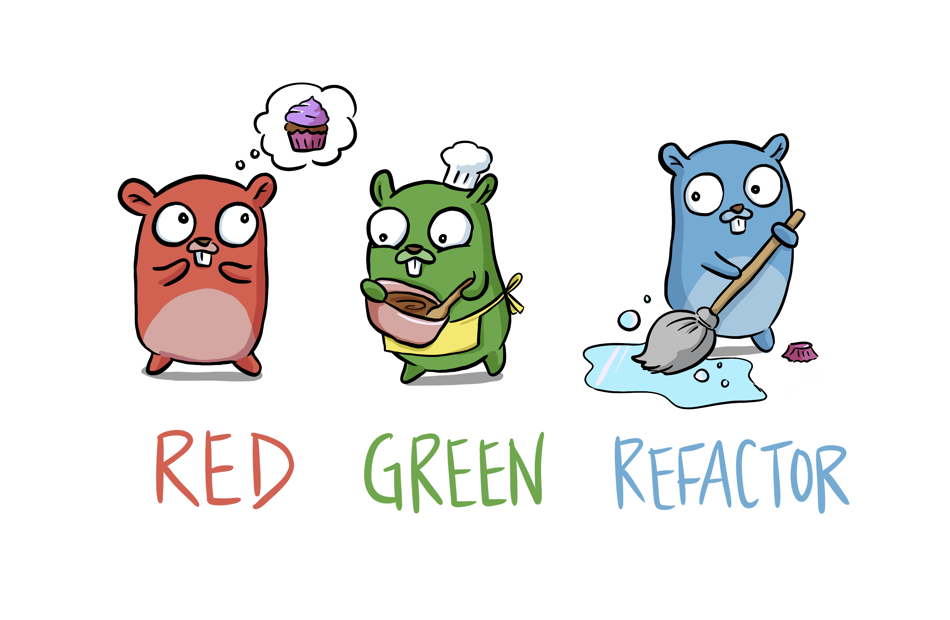
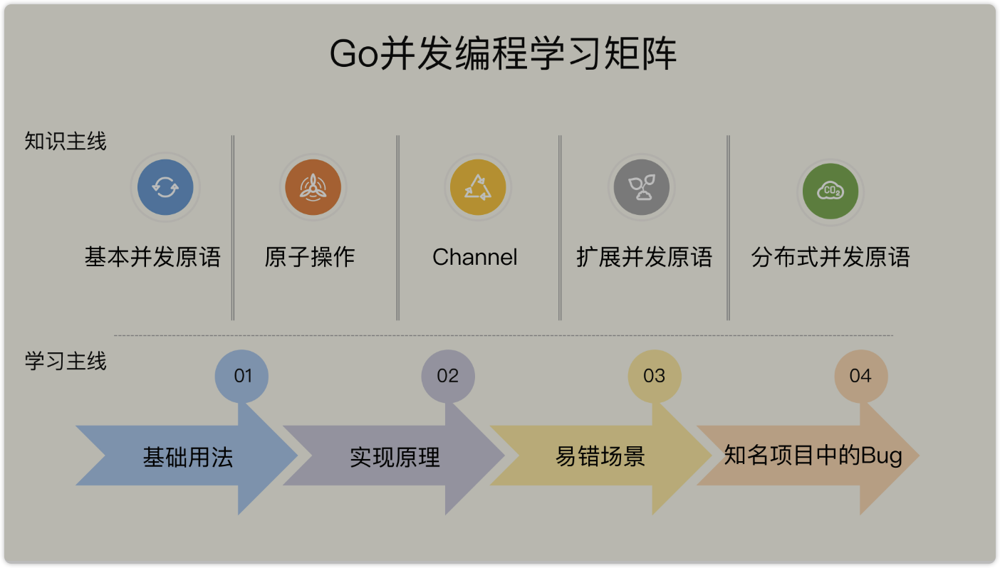
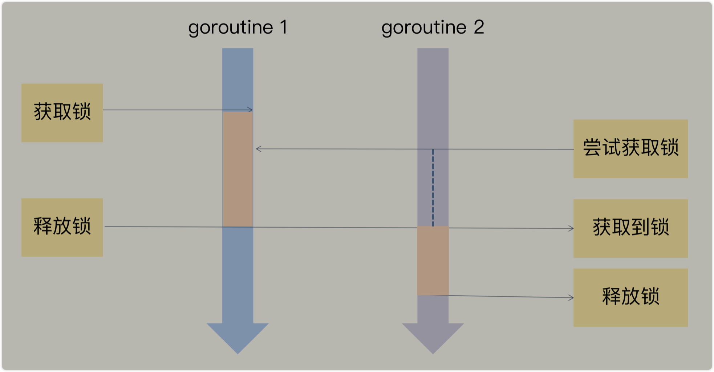
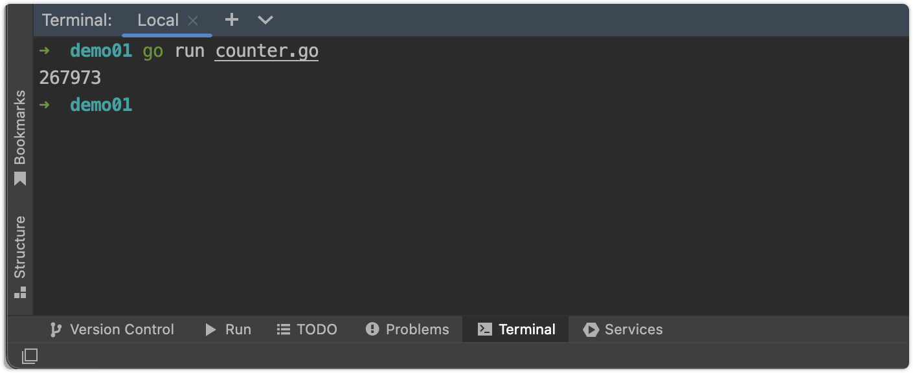

# Go 语言并发编程



## 小王作为笔者放在前面的话

*   这是小王二刷鸟窝大佬的Go语言并发编程的实战课
*   本人也是Go语言小白，在分享中不断向优秀的人进行学习
*   在这里还是推荐一下鸟窝老师的课程，受益匪浅，因为和大家一起学习📑
*   下面贴一个老师课程链接🔗，可以和我整理笔记📒总结学习

https://time.geekbang.org/column/intro/100061801?code=qfSvaj4kkWUDgv5GMWqtYjcXlzqeRWs3tme6iMgNJjw%3D

**废话不多说，即可发车～～～**


## 开篇词 ｜ 想吃透Go并发编程，你得这样学！

### 并发编程，为什么选Go？

**总结几点，压倒性的优势**

1.   高效简洁
     1.   （这点相比较之前小王从事的Java语言是有明显的优势的，但每个语言都有自己独特之处，充满特点）

2.   高效独特的协程
3.   高效丰富的数据结构

上述的概括中无疑都透露着"高效"二字，这也正是Go语言的魅力🤩

**Go 并发 编程的重要性不容置疑。只要是使用 Go 开发的大型应用程序，并发是必然要采用的技术。**


**下面献上Go语言并发编程的打怪路线**



*   基本并发原语：在这部分，我会介绍 Mutex、RWMutex、Waitgroup、Cond、 Pool、Context 等标准库中的并发原语，这些都是传统的并发原语，在其它语言中也很 常见，是我们在并发编程中常用的类型
*   原子操作：在这部分，我会介绍 Go 标准库中提供的原子操作。原子操作是其它并发原 语的基础，学会了你就可以自己创造新的并发原语
*   Channel：Channel 类型是 Go 语言独特的类型，因为比较新，所以难以掌握。但是别怕，我会带你全方位地学习 Channel 类型，你不仅能掌握它的基本用法，而且还能掌握 它的处理场景和应用模式，避免踩坑
*   扩展并发原语：目前来看，Go 开发组不准备在标准库中扩充并发原语了，但是还有一 些并发原语应用广泛，比如信号量、SingleFlight、循环栅栏、ErrGroup 等。掌握了它 们，就可以在处理一些并发问题时，取得事半功倍的效果
*   分布式并发原语：分布式并发原语是应对大规模的应用程序中并发问题的并发类型。我 主要会介绍使用 etcd 实现的一些分布式并发原语，比如 Leader 选举、分布式互斥锁、 分布式读写锁、分布式队列等，在处理分布式场景的并发问题时，特别有用


## 01 ｜ Mutex：如何解决资源并发访问问题？

### 并发访问的引入

*   并发访问在日常开发实在是太过于常见，所以我们必须要去对其总结处理方式
*   举几个小例子
    *   goroutine并发更新同一个资源，像计数器，这个是小王在开发中遇到的第一个问题，这里记录下！
    *   秒杀系统，超卖
*   并发导致的问题通常都是比较的严重的，所以我们必须要去学习一套属于我们自己的解决方案

**在Go语言中处理这些问题最简单的方式就是使用互斥锁，对！就是Mutex**

### 互斥锁的实现机制

互斥锁是并发控制的一个基本手段，是为了避免竞争而建立的一种并发控制机制。在学习 它的具体实现原理前，我们要先搞懂一个概念，就是**临界区**

#### 临界区

*   并发编程中如果程序中的一部分被并发访问或者是修改的话
*   为了避免并发访问导致的意外的结果，对这部分程序进行一个保护
*   这部分保存起来的程序也就是我们所说的临界区了

**临界区总结**

这样就可以说呀，临界区嘛，也就是被共享访问的资源，或者是说一个整体的一组共享的资源

*   比如对数据库的访问、对某一个共享数据结构的操作、对一个 I/O 设备的使用、对一个连接池中的连 接的调用

如果很多线程同时同步去访问这个临界区肯定是会出问题的，造成访问或者操作错误，**所以我们使用互斥锁，限定临界区只能同时由一个线程去持有**

*   当临界区由一个线程持有的时候，其它线程如果想进入这个临界区，就会返回失败，或者是等待
*   直到持有的线程退出临界区，这些等待线程中的某一个才有机会接着持有这个临界区

Mutex 是使用最广泛的同步原语（Synchronization primitives），有人也叫做并发原语



#### 同步原语的使用场景

共享资源: 并发地读写共享资源，会出现数据竞争（data race）的问题，所以需要 Mutex、RWMutex 这样的并发原语来保护。

任务编排: 需要 goroutine 按照一定的规律执行，而 goroutine 之间有相互等待或者依 赖的顺序关系，我们常常使用 WaitGroup 或者 Channel 来实现。

消息传递: 信息交流以及不同的 goroutine 之间的线程安全的数据交流，常常使用 Channel 来实现。

### Mutex的基本使用方法

Locker 的接口定义了锁同步原语的方法集

```go
type Locker interface { 
  Lock() Unlock() 
}
```

可以看到，Go 定义的锁接口的方法集很简单，就是请求锁（Lock）和释放锁（Unlock） 这两个方法，秉承了 Go 语言一贯的简洁风格。

#### 简单来说

**互斥锁 Mutex 就提供两个方法 Lock 和 Unlock：进入临界区之前调用 Lock 方法，退出临界区时调用 Unlock 方法：**

```go
// 加锁的方法
func(m *Mutex)Lock() 
// 解锁的方法
func(m *Mutex)Unlock()
```

*   当一个goroutine通过调用Lock的方法获得了这个锁的拥有权之后
*   其他请求锁goroutine就会阻塞在Lock这个方法的调用上
*   直到锁被释放并且自己获取到了这个锁的拥有权

#### 存在问题

**这个地方举一个小王最开始遇到的并发问题的例子🌰**

```go
import (
	"fmt"
	"sync"
)

func main() {
	var count = 0
	// 使用 WaitGroup 等待10个 goroutine 完成
	var wg sync.WaitGroup
	wg.Add(10)
	for i := 0; i < 10; i++ {
		go func() {
			defer wg.Done()
			// 对变量 count 执行 10 次加 1
			for j := 0; j < 100000; j++ {
				// 这个递增的操作并不是一个原子性的操作
				count++ // 读取当前值，对其累加，再去保存的操作
			}
		}()
	}
	// 等待10个 goroutine 完成
	wg.Wait()
	fmt.Println(count)
}
```



在这段代码中，我们使用 sync.WaitGroup 来等待所有的 goroutine 执行完毕后，再输出 最终的结果。sync.WaitGroup 这个同步原语我会在后面的课程中具体介绍，现在你只需 要知道，我们使用它来控制等待一组 goroutine 全部做完任务

*   因为这个地方count++并不是一个原子操作
*   它至少包含了几个步骤，读取变量，去当前值进行一个递增的操作，在进行保存的操作
*   因为这一系列的操作并不是原子操作，所以是会存在并发的问题

**count++的汇编代码**

```go
// count++操作的汇编代码
MOVQ "".count(SB), AX 
LEAQ 1(AX), CX 
MOVQ CX, "".count(SB)
```

这个问题，有经验的开发人员还是比较容易发现的，但是，很多时候，并发问题隐藏得非 常深，即使是有经验的人，也不太容易发现或者 Debug 出来。

**但是Go语言是存在一个完整的工具链的**

**Go race detector**基于C/C++实现

```bash
==================
WARNING: DATA RACE
Read at 0x00c000120028 by goroutine 8:
  main.main.func1()
Previous write at 0x00c000120028 by goroutine 6:
  main.main.func1()
Goroutine 8 (running) created at:
  main.main()
Goroutine 6 (running) created at:
  main.main()
==================
855434
Found 2 data race(s)
exit status 66
```

这个就是race的方式产生的分析结果

这个警告不但会告诉你有并发问题，而且还会告诉你哪个 goroutine 在哪一行对哪个变量 有写操作，同时，哪个 goroutine 在哪一行对哪个变量有读操作，就是这些并发的读写访 问，引起了 data race

#### 解决方案

下面，我就结合这个例子，来具体给你讲一讲 Mutex 的基本用法。

我们知道，这里的共享资源是 count 变量，临界区是 count++，只要在临界区前面获取 锁，在离开临界区的时候释放锁，就能完美地解决 data race 的问题了

```go
import (
	"fmt"
	"sync"
)

func main() {
	// 互斥锁保护计数器
	var mu sync.Mutex
	// 计数器的值
	var count = 0
	// 辅助变量，用来确认所有的goroutine是否都完成
	var wg sync.WaitGroup
	wg.Add(10)

	for i := 0; i < 10; i++ {
		go func() {
			defer wg.Done()
			// 累加10万次
			for j := 0; j < 100000; j++ {
				mu.Lock()
				count++
				mu.Unlock()
			}
		}()
	}
	wg.Wait()
	fmt.Println(count)
}

```

**简单说就是原本的临界区出现了并发问题，那么我们就直接加锁呗**

#### 其他用法 

很多情况，**Mutex 会嵌入到其它 struct 中使用**，这个很好去理解嘛，毕竟经常这么使用

```go
type Counter struct { 
  mu sync.Mutex 
  Count uint64
}
```

在初始化嵌入的 struct 时，也不必初始化这个 Mutex 字段，不会因为没有初始化出现空 指针或者是无法获取到锁的情况

```go
func main() {
	// 创建实例
	var counter Counter
  // 使用WaitGroup
  var wg sync.WaitGroup
  wg.Add(10)

	for i := 0; i < 10; i++ {
			go func() { 
        defer wg.Done()
        for j := 0; j < 100000; j++ {
          // 直接在这个结构体上进行操作即可
          counter.Lock()
          counter.Count++
          counter.Unlock()
        }
      }()
  } 
  wg.Wait() 
  fmt.Println(counter.Count)
}
```

如果嵌入的 struct 有多个字段，我们一般会把 Mutex 放在要控制的字段上面，然后使用 空格把字段分隔开来。即使你不这样做，代码也可以正常编译，只不过，用这种风格去写 的话，逻辑会更清晰，也更易于维护

```go
func main() {
    // 封装好的计数器
    var counter Counter
    
    var wg.sync.WaitGroup
    wg.Add(10)
    
    // 启动10个goroutine
    for i:=0; i<10; i++ {
        go func() {
            defer wg.Done()
            for j:=0; j<100000; j++ {
                counter.Incr() // 受到锁保护的方法
            }
        }()
    }
    wg.Wait()
    fmt.Println(counter.Count())
}

// 线程安全的计数器类型
type Counter struct {
    CounterType int 
    Name string
    mu sync.Mutex 
    count uint64
}

// 加1的方法，内部使用互斥锁保护 
func (c *Counter) Incr() {
    c.mu.Lock()
    c.count++
    c.mu.Unlock()
}

// 得到计数器的值，也需要锁保护
func (c *Counter) Count() uint64 {
    c.mu.Lock()
    defer c.mu.Unlock()
    return c.count 
}
```

### 总结

这节课，我介绍了并发问题的背景知识、标准库中 Mutex 的使用和最佳实践、通过 race detector 工具发现计数器程序的问题以及修复方法。相信你已经大致了解了 Mutex 这个 同步原语。

在项目开发的初始阶段，我们可能并没有仔细地考虑资源的并发问题，因为在初始阶段， 我们还不确定这个资源是否被共享。经过更加深入的设计，或者新功能的增加、代码的完 善，这个时候，我们就需要考虑共享资源的并发问题了。当然，如果你能在初始阶段预见 到资源会被共享并发访问就更好了。

意识到共享资源的并发访问的早晚不重要，重要的是，一旦你意识到这个问题，你就要及 时通过互斥锁等手段去解决。
