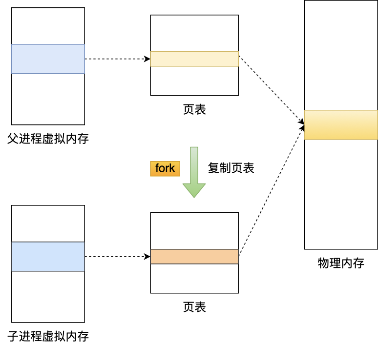
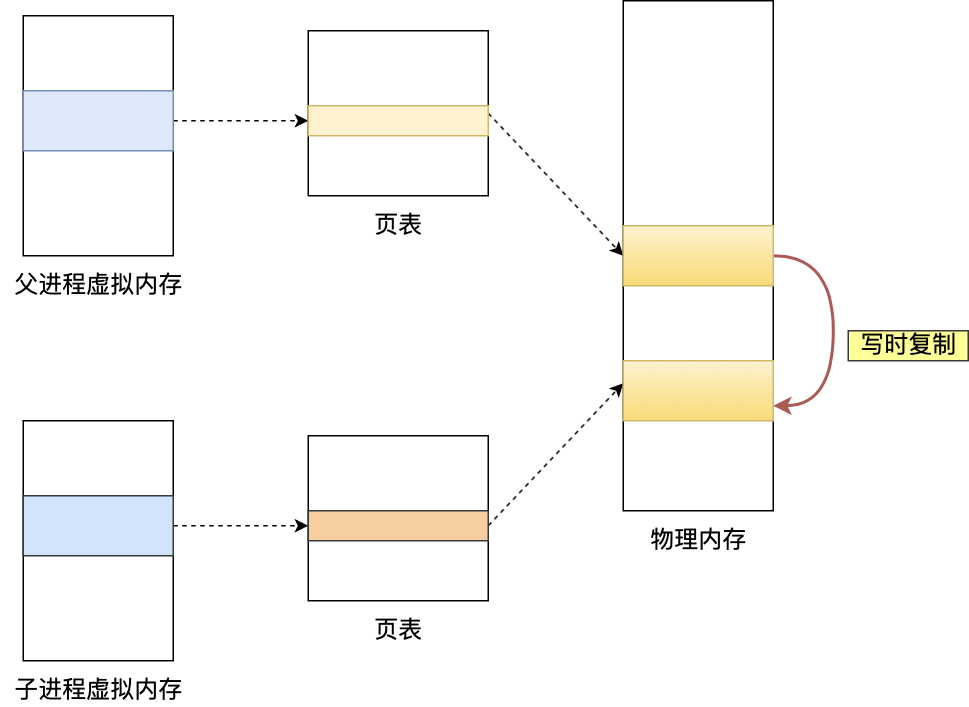

# 操作系统核心面试题解析

## 一、系统结构

### 1. 存储结构分级
**为什么计算机要采用分级存储结构？**  
不同级别的存储结构在访问速度、容量和成本上存在差异：
- **速度差异**：高速存储器（如CPU缓存）访问速度极快，但成本高、容量小。
- **成本与容量平衡**：通过分级（寄存器→缓存→内存→磁盘），将高频数据放在高速层，低频数据存于低速层，兼顾性能与经济性。
- **局部性原理**：程序访问具有时间与空间局部性，缓存机制可预加载相邻数据，减少访问延迟。

**CPU缓存层级（L1/L2/L3）的读取时间差异**  
- L1缓存：1-2纳秒  
- L2缓存：5-10纳秒  
- L3缓存：10-30纳秒  
尽管时间量级相近，但多级缓存设计通过逐层扩展容量，平衡速度与命中率。

**CPU缓存对程序性能的影响**  
- **局部性优化**：缓存行（Cache Line）预加载相邻数据，减少内存访问次数。  
- **数据对齐**：未对齐的数据可能跨缓存行，增加访问次数。  
- **伪共享问题**：多线程修改同一缓存行的不同变量，导致缓存失效。

---

## 二、内核态与用户态

### 1. 内核的核心作用
内核是操作系统的核心组件，负责：
- 管理硬件资源（CPU、内存、I/O设备）。
- 提供系统调用接口，隔离用户程序与硬件。
- 实现进程调度、内存管理、文件系统等核心功能。

### 2. 内核态与用户态的区别
- **权限级别**：内核态可执行特权指令（如I/O操作），用户态受限。  
- **资源访问**：内核态直接操作硬件，用户态需通过系统调用陷入内核。  
- **设计目的**：防止用户程序直接操作硬件，确保系统稳定性与安全性。

### 3. 用户态陷入内核态的触发条件
- **系统调用**：如读写文件（`read/write`）。  
- **异常**：除零错误、非法内存访问。  
- **外部中断**：硬件设备（如键盘、定时器）触发。

### 4. 系统调用过程详解
1. **参数传递**：用户程序通过寄存器传递系统调用号及参数。  
2. **软中断触发**：执行`int 0x80`（x86）或`syscall`指令，切换至内核态。  
3. **内核处理**：保存用户态上下文，根据调用号执行对应服务例程。  
4. **返回用户态**：恢复上下文，结果通过寄存器返回。

### 5. 切换开销大的原因
- **上下文保存**：需保存/恢复寄存器、栈指针等状态。  
- **模式切换**：CPU特权级别转换带来额外指令周期。  
- **TLB刷新**：切换地址空间导致缓存失效，增加内存访问延迟。

---

## 三、进程与线程管理

### 1. 进程 vs 线程
- **资源隔离**：进程拥有独立地址空间，线程共享进程资源（堆、文件描述符）。  
- **切换开销**：进程切换涉及页表、TLB刷新，线程仅切换CPU上下文。  
- **通信成本**：进程间通信（IPC）需内核介入，线程可直接共享内存。

### 2. 线程的应用场景
- **高并发I/O**：如Web服务器处理大量连接。  
- **计算密集型任务**：多线程利用多核并行计算。  
- **实时响应**：GUI应用需单独线程处理用户输入。

### 3. 僵尸进程与孤儿进程
- **僵尸进程**：子进程退出后未被父进程`wait()`回收，占用进程表项。  
- **孤儿进程**：父进程先退出，由init进程（PID=1）接管并回收。  
- **处理方式**：杀死父进程或父进程显式调用`wait()`。

### 4. 进程调度算法
- **FCFS**：简单公平，但长任务导致平均等待时间高。  
- **SJF**：最小化平均等待时间，需预知任务时长。  
- **轮转调度**：公平分配时间片，适合交互式系统。  
- **多级反馈队列**：动态调整优先级，平衡响应时间与吞吐量。

---

## 四、内存管理

### 1. 虚拟内存的核心作用
- **地址隔离**：每个进程拥有独立虚拟地址空间，防止内存冲突。  
- **内存扩展**：通过分页与交换（Swap）支持超过物理内存的程序运行。  
- **权限控制**：页表项标记读写权限，防止非法访问。

### 2. 页面置换算法对比
- **OPT**：理论最优，无法实现。  
- **FIFO**：简单但可能淘汰常用页面。  
- **LRU**：基于访问时间，近似OPT效果。  
- **Clock**：环形队列结合访问位，平衡效率与开销。

### 3. 进程虚拟内存布局
从高地址到低地址依次为：
1. **内核空间**：所有进程共享。  
2. **栈区**：自动管理，存放局部变量。  
3. **堆区**：动态分配，需手动管理（如`malloc/free`）。  
4. **数据段**：全局与静态变量。  
5. **代码段**：只读的程序指令。

---

## 五、文件系统与I/O

### 1. 文件读取流程
1. **系统调用**：`read()`触发上下文切换至内核态。  
2. **DMA介入**：磁盘数据直接搬运至内核缓冲区，无需CPU参与。  
3. **数据拷贝**：内核缓冲区→用户缓冲区，进程恢复执行。

### 2. 零拷贝技术
- **传统方式**：4次拷贝（磁盘→内核→用户→Socket内核→网卡）。  
- **零拷贝**：通过`sendfile()`实现内核缓冲区直接到网卡，仅2次DMA拷贝，减少CPU开销。  
- **应用场景**：文件传输（如Nginx、Kafka）。

### 3. 软链接 vs 硬链接
- **软链接**：独立inode，存储目标路径，支持跨文件系统，目标删除后失效。  
- **硬链接**：共享inode，直接指向数据块，不可跨文件系统，删除源文件不影响链接。

---

## 六、网络I/O模型

### 1. I/O多路复用
- **核心思想**：单线程监听多个Socket事件（如`select/poll/epoll`）。  
- **Epoll优势**：红黑树管理Socket，事件驱动通知，避免轮询开销。

### 2. 同步 vs 异步I/O
- **同步I/O**：数据就绪后需用户线程参与拷贝（如`read/write`）。  
- **异步I/O**：内核完成所有操作后通知用户线程（如`aio_read`）。

### 3. Reactor模式
- **单Reactor单线程**：处理I/O与业务逻辑，适用于低并发。  
- **单Reactor多线程**：I/O线程分发任务，工作线程处理业务。  
- **主从Reactor**：主线程处理连接，子线程处理读写，如Netty。

---

## 总结
操作系统是软件与硬件的桥梁，理解其核心机制（进程调度、内存管理、I/O模型）是开发高性能应用的基础。面试中需重点掌握虚拟内存、线程同步、I/O多路复用等高频考点，并结合实际场景（如高并发服务器设计）深化理解。持续关注底层原理，方能在复杂系统中游刃有余。

### 下面是整理的面试题

-   系统结构面试题

    -   存储结构

        -   为什么计算机要给储存结构分级

            

            

            -   不同级别的存储结构存在不同的访问速度

            -   但是访问速度越快的存储器，造价成本就会高很多，容量也会比较小

            -   通过分级存储结构，按照灵活的方式进行处理，频率速度成本

        -   CPU cache L1 L2 L3 读取数据的时间量级差距有多大

            

            -   差距不大，都是纳秒级别

            -   CPU 访问 CPU Cache L1 的延时大概是 1-2 纳秒

            -   访问 CPU Cache L2 的延时大概是 5-10 纳秒

            -   访问 CPU Cache L3 的延时大概是 10-30 纳秒

        -   CPU 缓存对程序性能的影响都体现在哪些方面

            -   程序具有局部性原理
                -   如果一个数据被访问，那么附近的数据很可能也会被访问

            -   CPU Cache就是基于这个局部性原理
                -   在访问的数据不在CPU Cache，不会只在内存中读取这一个数据，而且从内存连续加载数据到CPU Cache，相邻的数据也会换存在CPU Cache

            -   那么访问相邻的数据就可以不需要查内存，直接Cache中返回

    -   内核态（重要）

        -   什么是内核

            

            -   内核是操作系统的核心组件

            -   负责管理系统资源、提供硬件抽象层、调度任务和实现进程间通信等功能

            -   内核是系统中第一个加载的程序，并拥有最高的特权级别，控制整个系统的运行和资源分配

            -   它与用户空间程序进行交互，提供系统调用接口，实现了操作系统的基本功能

        -   内核态和用户态区别？为什么要区分内核态和用户态

            -   CPU将指令分为特权指令和非特权指令

            -   操作系统根据CPU的特权分级机制，把线程的运行空间分为内核空间和用户空间

            -   内核态具有最高权限，可以执行特权指令，直接访问所以系统和硬件资源

            -   用户态是访问受限资源的，让进程陷入到内核态才能访问这些特权资源

            -   之所以区分内核态和用户态目的就是为了保证系统的稳定和安全性

            -   通过限制应用程序对特权的指令的访问，可以防止恶意程序直接进行危险操作

        -   什么时候会由用户态陷入内核态

            -   系统调用
                -   触发软件中断

            -   异常
                -   非法内存

            -   外部设备中断信号
                -   输入输出设备，定时器中断

        -   系统调用的过程

            

            

            -   调用过程

                -   从用户态到内核态
                    -   产生中断，CPU陷入到内核态

                -   执行内核态逻辑
                    -   CPU 跳转到中断处理程序

                -   从内核态到用户态

            -   回答

                -   执行系统调用的时候，先将系统调用名称转换为系统调用号，接着将系统调用号和请求的参数放到寄存器中，然后执行软件中断命令，CPU会从用户态切换到内核态

                -   CPU 跳转到中断处理程序，将当前用户态的现场信息保存到内核栈中，接着根据系统调用号从系统调用表中找到对应的系统调用函数，并将寄存器中保存的参数取出来，作为函数参数，然后在内核中执行系统调用函数

                -   执行完系统调用后，执行中断返回指令，内核栈会弹出之前保存的用户态的现场信息，将原来用户态保存的现场恢复回来，这时候 CPU 恢复到用户态，用户态进程恢复执行

        -   用户态和内核态是如何切换的
            -   内核态与用户态的相互切换，其中最重要的一个步骤就是用户栈和内核栈的切换

        -   为什么用户态和内核态的相互切换过程开销比较大

            -   上下文切换

            -   权限切换

            -   地址空间切换

            -   TLB刷新

    -   中断

        -   什么是中断？为什么要有中断

            -   中断机制的好处是化主动为被动，避免 CPU 轮询等待某条件成立

                -   如果没有中断机制，那么“某个条件成立”就需要 CPU 轮询判断，这样就会增加系统的开销

                -   而使用中断机制，就可以在条件成立之后，向 CPU 发送中断事件，强制中断 CPU 执行程序，转而去执行中断处理程序

        -   什么是硬件中断和软件中断？（基本不问）

            -   硬件中断
                -   由硬件自动触发的中断就属于硬件中断
                    -   比如中断和异常都属于硬件中断，中断是由外部设备触发的，异常是由 CPU 触发的

            -   软件中断
                -   由软件程序主动触发的中断属于软件中断
                    -   比如 INT 指令，Linux 内核提供的系统调用，就是用了 INT 0x80 这种指令

        -   什么是硬中断和软中断？（基本不问）

            -   硬中断
                -   CPU 在每一个指令周期的最后，都会留一个 CPU 周期去查看是否有中断，如果有，就把中断号取出，去「中断向量表」中寻找中断处理程序，然后跳过去执行中断处理程序

            -   软中断
                -   就是有一个单独的守护进程，不断轮询一组标志位，如果哪个标志位有值了，那去这个标志位对应的「软中断向量表数组」的相应位置，找到软中断处理函数，然后跳过去执行软中断处理函数

        -   为什么要有软中断？（基本不问）

            -   软中断可以承接原本硬中断处理程序比较复杂且耗时的工作

            -   让硬中断的中断处理函数的逻辑尽可能的简单，从而提高系统的中断响应速度

    -   Linux 启动

        -   第一步
            -   当我们打开电源时，BIOS（基本输入/输出系统，Basic Input/Output System）或 UEFI（统一可扩展固件接口，Unified Extensible Firmware Interface）固件会从非易失性内存中加载，并执行 POST（开机自检，Power On Self Test）

        -   第二步
            -   BIOS/UEFI 检测连接到系统的设备，包括 CPU、内存和存储设备

        -   第三步
            -   选择一个启动设备来启动操作系统。可以是硬盘、网络服务器或 CD ROM

        -   第四步
            -   BIOS/UEFI 运行引导加载器 (GRUB)，它提供了一个选择操作系统或内核功能的菜单

        -   第五步
            -   内核准备就绪后，我们现在切换到用户空间。内核启动 systemd 作为第一个用户空间进程，负责管理进程和服务、探测所有剩余硬件、挂载文件系统并运行桌面环境

        -   第六步
            -   系统启动时，systemd 默认激活 default.target 单元。同时还会执行其他分析单元

        -   第七步
            -   系统运行一组启动脚本并配置环境

        -   第八步
            -   用户将看到一个登录窗口

        -   系统现已准备就绪

-   进程管理面试题（重点）

    -   进程与线程（重要）

        -   进程和线程有什么区别

            -   定义区别

                -   进程就是运行起来的可执行程序

                -   主线程和进程之间相互依存的关系，主线程结束进程也会结束

            -   共享资源区别

                -   进程有自己独立的地址空间，不与其他进程分享

                -   一个进程中可以存在多个线程，彼此共享同一个地址空间

            -   上下文切换区别
                -   进程和线程之间的上下文切换都会存在内核态和用户态的切换

            -   安全性区别
                -   并发应用开发可以用多进程或多线程的方式。多线程由于可以共享资源，效率较高

        -   为什么需要线程

            -   并发能力
                -   程序的并发执行，同一时间同时执行多个任务

            -   切换开销
                -   线程的上下文切换开销比进程小

            -   通信方便
                -   同一进程内，多线程可以共享进程内的资源

        -   多线程是不是越多越好，太多会有什么问题

            -   切换开销
                -   线程的创建和切换会消耗系统资源，包括内存和CPU

            -   死锁的问题
                -   过多的线程可能会导致竞争条件和死锁的问题

        -   什么时候用单线程，什么时候用多线程呢

            -   一般单个逻辑比较简单，速度相对来说非常快的情况下可以使用单线程

            -   逻辑相对复杂的前提下，等待时间长或者是需要进行大量的计算场景

        -   线程共享了进程的哪些资源

            -   虚拟内存空间
                -   线程可以访问进程的代码区、堆区、数据区等资源

            -   文件描述符
                -   线程可以通过文件描述符访问进程打开的文件、套接字等资源

            -   信号处理器
                -   意味着线程可以接收和处理进程收到的信号

        -   为什么创建进程比创建线程慢

            -   Linux 中创建一个进程自然会创建一个线程，也就是主线程

            -   创建进程需要为进程划分出一块完整的内存空间，包含代码区、堆区、栈区、数据区等内存资源

            -   创建线程则简单得多，只需要确定 PC 指针和寄存器的值，并且给线程分配一个栈用于执行程序，同一个进程的多个线程间可以复用进程的虚拟内存空间，减少了创建虚拟内存的开销

            -   因此，创建进程比创建线程慢，而且进程的内存开销更大

        -   为什么进程的切换比线程开销大

            -   切换CPU上线

            -   切换页表
                -   切换了页表会影响TLB的命中率
                    -   那么虚拟地址转换为物理地址就会变慢，表现出来的就是程序运行会变慢

            -   而线程切换只需要切换 CPU 上下文，不会改变虚拟地址空间，不会影响TLB命中率

        -   线程的上下文切换是怎么个过程

            -   线程发生上下文切换，正在运行的线程会将寄存器的状态保存到内核的TCB（线程控制块）

            -   然后恢复另一个线程的上下文

            -   和进程的区别就是，线程需要切换CPU的上下文，不会改变地址空间

        -   进程有哪些状态

            

            -   在大学课本中学到的进程的状态主要就是5种
                -   创建状态、就绪状态、运行状态、阻塞状态、结束状态

            -   一个进程刚开始创建的时候，是处于创建状态

            -   随后就会进入就绪状态

            -   等待被操作系统调度，当进程被调度器选中后，就会进入运行状态

            -   此时进程就持有 CPU 执行权，当进程发生 I/O 事件的时候，就会进入到阻塞状态

            -   等待 I/O 事件完成，I/O 事件完后进程就会恢复为就绪状态

            -   当进程退出后，就会变为结束状态

        -   僵尸进程，孤儿进程，守护进程的区别

            -   僵尸进程（记忆点：儿子死了，爸爸没有收尸，儿子就成僵尸了）

                -   僵尸进程是指终止但还未被回收的进程。如果子进程退出，而父进程并没有调用 wait() 或 waitpid() 来回收，那么就会产生僵尸进程

                    -   父进程调用 wait 或者 waitpid 等待子进程结束

                    -   子进程结束时，内核会发生 SIGCHLD 信号给父进程。父进程可以注册一个信号处理函数，在该函数中调用 waitpid，等待所有结束的子进程；也可以用 signal(SIGCLD, SIG_IGN) 忽略 SIGCHLD 信号，那么子进程结束后，内核会进行回收

                    -   杀死父进程，僵尸进程就会变成孤儿进程，由 Init 进程接管并处理

            -   孤儿进程（记忆点：爸爸没了，就是孤儿）

                -   如果某个进程的父进程先结束了

                -   那么它的子进程会成为孤儿

                -   进程每个进程结束的时候，系统都会扫描是否存在子进程，如果有则用 Init 进程（pid = 1）接管，并由 Init 进程调用 wait 等待其结束，完成状态收集工作

                -   孤儿进程不会对系统造成危害

            -   守护进程
                -   守护进程（英语：daemon）是运行在后台的一种特殊进程。它独立于控制终端并且周期性地执行某种任务或等待处理某些发生的事件

            -   回答

                -   僵尸进程是指子进程已经终止，但其父进程尚未调用wait()或waitpid()函数来获取子进程的终止状态，导致子进程的进程描述符仍然保留在系统进程表中，成为僵死进程，僵死进程不占用系统资源，但会占用一个进程ID

                -   孤儿进程是指父进程先于子进程退出或异常终止，导致子进程成为孤儿进程。孤儿进程会被init进程（进程ID为1）接管，init进程会成为孤儿进程的新的父进程

                -   守护进程是在后台运行的一种特殊进程，不与任何终端关联，关闭终端并不会影响守护进程的生命周期，守护进程的生命周期通常是伴随系统的启动和关闭，会一直在后台运行

        -   怎么杀死僵尸进程

            -   僵尸进程是已经死了的，不能直接使用 kill 命令杀掉僵尸进程

            -   只能通过 ps 命令找到僵尸进程的父进程的 pid 号，然后通过 kill 命令杀掉父进程的方式来达到僵尸进程的效果

            -   因为当父进程被杀掉后，操作系统会将僵尸进程的父进程会变为 1 号 init 进程，接着 init 进程会自动接管僵尸进程的回收工作

        -   并行和并发的区别

            -   并发
                -   多个线程在单核CPU上交替运行，同一时间只存在一个线程在运行

            -   并行
                -   多个线程在多核CPU上同时运行，同一时间可以有多个线程同时执行

        -   多进程和多线程的区别

            -   多线程由于可以共享进程资源，而多进程不共享地址空间和资源

            -   多进程需要通过进程间通信技术来实现数据传输，开发起来比较的麻烦‘

            -   但是多进程安全性比较好，某一个进程出现问题时，其他的进程一般不受影响

            -   在多线程的情况下，一个线程执行了非法操作会导致整个进程退出

        -   一个进程fork出一个子进程，那么他们占用的内存是之前的2倍吗

            

            -   fork 的时候，创建的子进程是复父进程的虚拟内存，并不是物理内存

            -   这时候父子的虚拟内存指向的是同一个物理内存空间

            -   这样能够节约物理内存资源，页表对应的页表项的属性会标记该物理内存的权限为只读

            

            -   不过，当父进程或者子进程在向这个内存发起写操作时，CPU 就会触发写保护中断，这个写保护中断是由于违反权限导致的，然后操作系统会在「写保护中断处理函数」里进行物理内存的复制，拷贝原来页的内容到新页，然后修改页表项内容指向新页并修改为可读写，这个过程被称为「写时复制」，发生了这个过程，内存占用才会增多

    -   协程

        -   什么是协程

            -   协程是一个用户态线程

            -   用户在堆上模拟出协程的栈空间

            -   当需要进行协程上下文切换的时候，主线程只需要交换栈空间和恢复协程的一些相关的寄存器的状态，就可以实现上下文切换

            -   相比于线程上下文切换，没有了从用户态转换到内核态的切换成本

        -   协程和线程有什么区别？（重要）

            -   线程调度是内核负责，协程调度是由用户负责，协程的切换更快

            -   线程的栈比协程栈大很多

                -   线程的栈在运行时栈不能够更改

                -   协程栈在 Go 运行时的帮助下可以动态检测栈的大小，进行扩容和收缩

            -   协程的调度是协作式调度，当一个协程处理完自己的任务后，可以主动将执行权限让给其他协程

            -   而线程是抢占式调度，线程的切换的主动权不再线程自己身上

        -   协程切换的本质是什么

            -   协程的切换本质就是切换CPU寄存器

            -   把当前协程的 CPU 寄存器状态保存起来
                -   比如IP、SP寄存器，然后将需要切换进来的协程的 CPU 寄存器状态加载到 CPU 寄存器上就完成了切换的过程

            -   整个切换过程发生在用户态，不会陷入内核态

        -   为什么协程切换的开销比线程切换小

            -   用户态切换

                -   协程的切换本质上是CPU寄存器，只是用户态的切换

                -   线程是在用户态和内核态上的切换

            -   协作式调度

                -   协程是协作式

                -   线程是抢占式

    -   进程间通信（重要）

        -   进程间有哪些通信方式

            -   管道

                -   通信数据是无格式的字节流

                -   分为匿名管道和有名管道

            -   消息队列

                -   内核中通过链表来组织消息的

                -   克服了管道通信是无格式的字节流

            -   管道和消息队列在读写数据的时候都是经过用户态和内核态之间的拷贝的
                -   共享内存解决这个问题

            -   信号量
                -   实现进程间的同步和互斥访问共享资源

            -   信号
                -   异步的通知机制，用于通知进程某个事件已经发生

            -   socket通信

                -   前面提到的这些通信方式都只能在本机上进行进程间通信

                -   如果要实现跨主机的进程间通信，就需要通过 socket 通信了
                    -   可以实现基于 TCP 或者 UDP 协议的通信方式

        -   哪个进程间通信效率最高的

            

            -   共享内存的通信效率最高
                -   共享内存不涉及内核态和用户态之间的数据拷贝

        -   有名管道和匿名管道的区别

            -   匿名管道
                -   没有文件实体，不能用于非亲缘进程间通信，只能用于在父子进程之间进行通信，并且匿名管道只存在于创建它的进程的内存中，进程退出后即被销毁

            -   有名管道
                -   存在文件实体，可以用于任意进程间的通信，并且数据可以持久化保存，即使创建它的进程退出，其他进程仍然可以使用该管道

        -   信号和信号量的区别

            -   信号

                -   一种异步的通知机制，用于通知进程某个事件已经发生

                -   当一个信号发送给一个进程时，操作系统会中断进程的正常流程来处理信号

            -   信号量

                -   一种用于解决多进程同步和互斥问题的工具，主要用于保护共享资源，防止多个进程同时访问

                -   信号量有一个整数值，该值的含义是可以同时访问某个资源的进程数量

                -   当一个进程想要访问资源时，它会尝试递减信号量（称为P操作）

                -   如果信号量的值大于零，这个操作会成功，否则进程就会阻塞，直到信号量变为正数

                -   当进程完成对资源的访问后，它会递增信号量（称为V操作），允许其他阻塞的进程访问资源

    -   调度

        -   进程的调度算法有哪些

            -   先来先服务

                -   按照进程到达的顺序进行调度，先到达的进程先执行

                -   优势是简单、公平，但可能导致长作业等待时间过长，无法适应实时性要求高的场景

            -   最短作业优先

                -   选择估计运行时间最短的进程优先执行

                -   优势是能够最大程度地减少平均等待时间，但需要准确预测进程的运行时间，这个实现起来会比较困难

            -   轮转调度

                -   按照时间片的方式轮流调度进程执行，每个进程分配一个固定的时间片，时间片用完后切换到下一个进程

                -   优势是公平，但对于长作业和实时性要求高的场景可能不够高效

            -   优先级调度

                -   为每个进程分配一个优先级，优先级高的进程先执行。可根据不同的调度策略确定优先级，如静态优先级、动态优先级等

                -   优势是能够根据进程的重要性和紧急程度进行调度，但可能导致优先级低的进程长时间等待

            -   多级反馈队列调度

                -   将进程划分为多个队列，每个队列有不同的优先级和时间片大小，每个队列优先级从高到低，同时优先级越高时间片越短，新的进程会被放入到第一级队列的末尾，按先来先服务的原则排队等待被调度，如果在第一级队列规定的时间片没运行完成，则将其转入到第二级队列的末尾，以此类推，直至完成

                -   如果进程运行时，有新进程进入较高优先级的队列，则停止当前运行的进程并将其移入到原队列末尾，接着让较高优先级的进程运行

                -   多级反馈队列调度存在的问题，优先级较低的队列可能会被优先级较高的队列长时间占用，导致优先级较低的进程无法得到执行，从而产生饥饿现象

    -   锁（重要）

        -   线程间同步方式有哪一些

            -   互斥锁
                -   保护共享资源，确保同一时间只有一个线程可以访问该资源

            -   读写锁

                -   共享-独占锁，允许多个线程同时读取共享资源，但在写操作时需要独占访问

                -   读写锁在读多写少的场景中可以提供更好的并发性能

            -   信号量

                -   用于控制对一组资源的访问

                -   信号量可以允许多个线程同时访问资源，但是需要在访问前进行P操作（申请资源）和在访问结束后进行V操作（释放资源），以确保资源的正确使用

            -   自旋锁

                -   是一种忙等待锁，在获取锁之前，线程会一直尝试获取锁，而不会进入睡眠状态

                -   自旋锁适用于保护临界区较小、锁占用时间短暂的情况

            -   条件变量

                -   用于在线程之间进行条件同步

                -   一个线程可以等待某个条件满足

                -   另一个线程在满足条件时可以通知等待的线程继续执行

        -   信号量和互斥锁应用场景有什么区别

            -   资源共享

                -   信号量一般以同步的方式对共享资源进行控制

                -   互斥锁通过互斥的方式对共享资源对其进行控制

            -   资源访问

                -   信号量可以控制有限资源的访问

                -   互斥锁只能控制一个资源的访问

            -   加锁解锁

                -   互斥量的加锁和解锁必须由同一线程分别对应使用

                -   信号量可以由一个线程释放，另一个线程得到

        -   自旋锁和互斥锁有什么区别？分别适合哪些应用场景

            -   互斥锁加锁失败的时候，线程会放弃CPU，陷入到内核态，执行线程切换和CPU上下文切换的过程，切换到其他线程，而自旋锁加锁失败后，线程不会放弃 CPU，而是选择忙等待，直到它拿到锁

            -   自旋锁适用于并发竞争时间短暂的情况，可以减少线程切换和CPU上下文切换的开销。互斥锁适用于并发竞争时间较长或资源争用较激烈的情况，可以避免线程忙等待，但会带来线程切换和上下文切换的开销

        -   悲观锁和乐观锁有什么区别

            -   悲观锁做事比较悲观，它认为多线程同时修改共享资源的概率比较高，很容易出现冲突，造成数据错乱，所以会每次读写共享资源之前，先要加锁，确保任意时刻只有一个线程才能对数据进行读写操作

            -   乐观锁做事比较乐观，它假定冲突的概率很低，先修改完共享资源，再验证这段时间内有没有发生冲突，如果没有其他线程在修改资源，那么操作完成，如果发现有其他线程已经修改过这个资源，就放弃本次操作，并选择报错、重试等策略

            -   悲观锁适合并发写入多和竞争激烈的场景，这种场景下悲观锁可以避免大量的无用的反复尝试等消耗。乐观锁适合读多写少和并发不激烈的场景，在这些场景下乐观锁不加锁的特点能让性能大幅提高

        -   乐观锁怎么实现

            -   乐观锁的实现通常基于版本号或时间戳机制
                -   比如 CAS 算法是乐观锁的一种实现方式，它包含三个参数：内存地址、期望值和新值

            -   CAS操作会比较内存位置的当前值与期望值是否相等

                -   如果相等，则将内存地址的值更新为新值

                -   如果不相等，则说明其他进程或线程已经修改过内存地址的值，就不会修改数据，会根据不同的业务逻辑去选择报错或者重试

        -   操作系统死锁怎么产生的

            

            -   当两个或者以上线程并行执行的时候，争夺资源而造成相互等待的现象，这时候就是发生了死锁

            -   死锁产生的四个必要条件

                -   互斥条件

                -   持有并等待条件

                -   不剥夺条件

                -   环路等待条件

                -   只要上述条件之一不满足，就不会发生死锁

        -   如何避免死锁

            

            -   加锁顺序
                -   使用资源有序分配法来破坏环路等待条件

            -   加锁时限

            -   死锁检测

        -   发生死锁时，怎么排查

            -   Java
                -   jstack

            -   C++
                -   gdb

            -   Golang
                -   pprof

-   内存管理面试题（重点）

    -   为什么操作系统会有虚拟内存（重要）

        -   如果没有虚拟内存，程序直接操作物理内存的话，多个进程会相互干扰彼此的内存数据，一个进程可能会访问或修改另一个进程的内存数据，从而破坏系统的稳定性和安全性

        -   有了虚拟内存后，进程只能操作虚拟内存，不能操作物理内存，每个进程的虚拟地址空间是相互独立的，进程不能访问其他进程的虚拟地址，这就解决了多进程之间地址冲突的问题

        -   还有虚拟内存可以使得进程对运行内存超过物理内存大小，通过将没有被经常使用到的内存，我们可以把它换出到物理内存之外，比如硬盘上的 swap 区域，只在需要时再将数据加载到内存中

    -   虚拟内存有什么作用（重要）

        -   虚拟内存可以使得进程对运行内存超过物理内存大小，提高内存的利用率

        -   由于每个进程都有自己的页表，所以每个进程的虚拟内存空间就是相互独立的

            -   进程也没有办法访问其他进程的页表，所以这些页表是私有的，

            -   这就解决了多进程之间地址冲突的问题

        -   页表里的页表项中除了物理地址之外，还有一些权限控制的属性

    -   什么是内存分段

        -   内存分段其实是：将程序按代码、数据、堆、栈进行拆分，再将4部分按照段表去进行映射

        -   而内存是被动的被逻辑划分了

    -   什么是内存分页

        -   把内存空间划分为大小相等且固定的块，作为主存的基本单位

        -   因为程序数据存储在不同的页面中，而页面又离散的分布在内存中，因此需要一个页表来记录映射关系，以实现从页号到物理块号的映射

    -   段式管理和页式管理会出现内存碎片吗

        -   段式管理没有内部碎片，但是有外部碎片
            -   由于每个段的长度不是固定的，所以段与段之间会产生碎片，这种称为外部碎片

        -   页式管理有内部碎片，但是没有外部碎片
            -   页内出现内存浪费，也就是内存碎片，这种称为内部碎片

    -   页面置换有哪些算法

        -   最佳置换算法（OPT）：置换掉未来永远不会被访问，理论上这种算法效果最好，但是在实际中无法得知未来进程的行为，所以无法实现。

        -   先进先出算法（FIFO）：置换掉最早进入内存的页面。这个算法简单，易于实现，但可能导致"先进入"的页面是常用页面而被频繁置换，造成性能下降。

        -   最近最久未使用算法（LRU）：置换掉最近一段时间内最久未被使用的页面，算法的实现是给每个页面设置一个时间戳，记录最近一次访问的时间，如果发生缺页错误，则从所有页面中淘汰时间戳最久远的一个。

        -   时钟算法（Clock）：每页设置一个访问位，再将内存中的所有页面都通过链接指针链接成一个循环队列。当某个页面被访问时，其访问位置1。淘汰时，检查其访问位，如果是0，就换出；若为1，则重新将它置0，然后检查下一个页面，如果到队列中的最后一个页面时，若其访问位仍为1，则再返回到队首再去检查第一个页面。

        -   最少使用算法（LFU）：置换掉访问频率最少的内存页面，实现方式是对每个页面设置一个访问计数器，每当一个页面被访问时，该页面的访问计数器就累加 1，如果发生缺页错误，淘汰计数器值最小的那个页面。

    -   数组的物理空间连续吗

        -   不是的

        -   数组的虚拟地址是连续的

        -   但是虚拟地址映射到物理地址是由操作系统负责的

        -   操作系统并不会保证映射的物理地址也是连续的

    -   进程的虚拟内存的布局是怎么样的（重要）

        

        -   操作系统将每个进程的虚拟地址空间划分成两个部分：内核空间和用户空间。内核空间存放的是内核代码和数据，用户空间存放的是用户程序的代码和数据。

        -   进程的虚拟内存空间，从高地址到低地址分别是：

            -   内核虚拟内存：所有进程共享内核的代码和数据，独享与进程相关的数据结构

            -   栈段：包括局部变量和函数调用的上下文等，栈的大小是固定的，一般是 8 MB

            -   文件映射段：包括动态库、共享内存等

            -   堆段：包括动态分配的内存

            -   BSS 段：包括未初始化的静态变量和全局变量

            -   数据段：包括已初始化的静态常量和全局变量；

            -   代码段：包括二进制可执行代码；

    -   栈的增长趋势是什么
        -   栈是从内存高地址往低地址增长

    -   堆区和栈区有什么区别

        -   栈区的内存用于函数调用栈，主要保存函数的入参、局部变量、返回值等，栈区内存不可被其他线程共享，栈区的内存管理是由编译器自动完成的，编译时就确定了变量的生命周期，不需程序员来分配内存和释放内存，当函数执行结束时，栈区中的数据会自动被释放。

        -   堆区内存需要通过动态内存分配函数来申请，堆区的内存可被其他线程共享，堆区内存的生命周期是由程序员控制的，需要进行显示分配和释放内存，如果反复向操作系统申请堆内存而不释放，会导致内存泄露。在 C / C++ 中，必须由程序员手动释放堆内存。而 Java / Golang 中有垃圾回收器，会定期主动回收内存。但是即使有垃圾回收器，也有内存泄漏的风险，比如长期持有某个大对象的引用。

        -   堆区可分配的大小会比栈大很多，因为栈的内存是限的，通常是 8MB 大小，而堆的空间较大，受限于系统中有效的虚拟内存，比如 32 位系统，虚拟内存最大 4GB，64 位操作系统就 128TB。

        -   栈区的内存分配效率会比堆区分配内存效率高，因为分配栈区内存，只需要移动栈指针即可，而分配堆区内存需要在堆中找到可用的内存块。

    -   在栈上的数据操作比堆上快很多的原因

        -   访问栈上的数据是可以直接访问，因为 CPU 有栈相关的寄存器直接对栈进行访问，而堆上的数据需要通过指针进行访问，是一个间接寻址的过程，访问速度相对较慢

        -   还有栈上的数据是连续存在，这样可以更好的利用 CPU 的 CPU Cache，访问栈上的数据缓存命中率比较高，而堆上的数据分布是散乱的，无法充分利用 CPU 缓存，导致缓存命中率较低，访问速度相对较慢

    -   32 位操作系统，4G物理内存，程序可以申请 8GB内存吗

        -   程序申请的内存实际上是虚拟内存，32 位操作系统中用户空间的虚拟内存大小是 3 GB

        -   进程最多只能申请 3 GB 大小的虚拟内存空间

        -   所以进程申请 8GB 内存的话，在申请虚拟内存阶段就会失败

    -   64 位操作系统，4G物理内存，程序可以申请 8GB内存吗

        -   在 64位 位操作系统，因为进程理论上最大能申请 128 TB 大小的虚拟内存，即使物理内存只有 4GB，申请 8G 内存也是没问题，因为申请的内存是虚拟内存。如果这块虚拟内存被访问了，要看系统有没有 Swap 分区：

            -   如果没有 Swap 分区，因为物理空间不够，进程会被操作系统杀掉，原因是 OOM（内存溢出）

            -   如果有 Swap 分区，即使物理内存只有 4GB，程序也能正常使用 8GB 的内存，进程可以正常运行

    -   fork 的写时复制是如何实现的

        -   fork 是创建进程的系统调用， 执行 fork 的时候，子进程会复制父进程的 PCB 复制一份，这里包含页表、文件资源等，并且将页表的权限设置为只读，但是并不会复制物理内存，所以这时候父子进程的页表指向的物理内存的是同一片区域，此时父子进程的内存数据都是共享的

        -   当父进程或者子进程对这片共享的内存数据进行了写操作，发现页表是只读的属性，这时候就会发生写保护中断，内核就会为发生中断的进程分配新的物理内存，把老的物理页的数据拷贝进这个新的物理页，然后将最新的数据写入到这个新的物理页，最后把发生中断的虚拟地址映射到新的物理页，同时该进程的页表的权限设置为可读写，这就完成了一次写时复制

    -   malloc会陷入内核态吗？malloc的底层原理是什么

        -   malloc 不是系统调用函数，不会陷入到内核态

        -   malloc 申请内存的时候，会通过 brk 或者 mmap 这两个系统调用来申请内存

        -   为了避免频繁向操作系统申请内存，malloc 还实现了内存池化技术，先申请一大块内存，然后将内存分成不同大小的内存块，然后用户申请内存时，直接从内存池中选择一块相近的内存块即可，这样就减少系统调用的开销

-   文件系统面试题

    -   读取一个文件的时候，操作系统会发生什么

        -   读取磁盘文件的时候，CPU 不会负责从磁盘读取数据的过程，而是将磁盘数据搬运到内存的工作全部交给 DMA 控制器，CPU 不再参与任何与数据搬运相关的事情，这样 CPU 就可以去处理别的工作，不会阻塞住

        -   具体的过程是这样的：

            -   用户进程调用 read 方法，向操作系统发出 I/O 请求，然后进程进入阻塞状态；

            -   操作系统收到请求后，进一步将 I/O 请求发送 DMA，然后 CPU 会执行其他任务；

            -   DMA 进一步将 I/O 请求发送给磁盘，磁盘收到 DMA 的 I/O 请求，把数据从磁盘读取到磁盘控制器的缓冲区中，当磁盘控制器的缓冲区被读满后，向 DMA 发起中断信号，告知自己缓冲区已满；

            -   DMA 收到磁盘的信号，将磁盘控制器缓冲区中的数据拷贝到内核缓冲区中，数据准备好后，然后就会发送中断信号给 CPU，CPU 收到 DMA 的信号，于是将数据从内核拷贝到用户空间，read 系统调用返回；

    -   操作系统复制一个文件的流程是怎么样的

        -   打开源文件，调用 read 系统调用读取源文件的数据，这时候会通过 DMA 将磁盘数据拷贝到内核缓冲区，然后 CPU 再将内核缓冲区的数据拷贝到用户缓冲区，然后 read 系统调用返回

        -   打开目标文件，调用 write 系统调用将从源文件读到的数据，写入到目标文件，这时候 CPU 会将用户缓冲区的数据拷贝到内核缓冲区， 然后write函数返回，后续操作系统会将内核缓冲区的数据刷入磁盘

    -   软链接和硬链接有什么区别

        -   软链接文件有独立的 inode 节点，文件的内容是目标文件的路径，不存储实际的文件数据，支持跨文件系统建立，而且目标文件删除了，软链接还是存在的，只不过指向的文件找不到了

        -   硬链接文件和目标文件都共用一个 inode 节点，说明他们是用一个文件，不支持跨文件系统建立，删除文件的时候，要除文件的所有硬链接以及源文件时，系统才会彻底删除该文件

-   网络 I/O面试题（重点）

    -   说一下Linux五种IO模型（重要）

        -   I/O模型：阻塞 I/O、非阻塞 I/O、信号驱动式 I/O、I/O 多路复用、异步 I/O，其中前四个都属于同步I/O模型

        -   阻塞同步I/O模型和非阻塞同步I/O模型的区别在于
            -   进程发起系统调用后，是会被挂起直到收到数据后在返回、还是立即返回成功或错误。

        -   同步I/O 和异步I/O 的区别在于
            -   将数据从内核复制到用户空间时，用户进程是否会阻塞，如果用户进程会阻塞，则是同步I/O，如果不会阻塞就是异步  I/O

    -   阻塞IO和非阻塞IO的应用场景问题，一个计算密集型的场景，和一个给用户传视频的场景，分别应该用什么io

        -   计算密集型的场景，需要消耗的是 CPU 资源，用阻塞 IO 会比较好，如果用非阻塞 IO，在非阻塞IO模型中，用户线程需要不断地询问内核数据是否就绪，也就说非阻塞IO不会交出CPU，而会一直占用CPU

        -   用户传视频的场景，瓶颈不是 CPU 资源，用非阻塞 IO 比较好，使用非阻塞IO可以避免阻塞在传输函数上，提高程序的并发性和响应速度

    -   谈谈你对 I/O 多路复用的理解（重要）

        -   如果不使用 I/O 多路复用，服务端要并发处理多个客户端的 I/O 事件的话，需要通过创建子进程或者线程的方式来实现，也就是针对每一个连接的  I/O 事件要需要一个子进程或者线程来处理，但是随着客户端越来越多，意味着服务端需要创建更多的子进程或者线程，这样对系统的开销太大了

        -   那么有了 I/O 多路复用就可以解决这个问题，I/O 多路复用可以实现是多个I/O复用一个进程，也就是只需要一个进程就能并发处理多个客户端的 I/O 事件， 进程可以通过select、poll、epoll这类 I/O 多路复用系统调用接口从内核中获取有事件发生的 socket 集合，然后应用程序就可以遍历这个集合，对每一个 socket 事件进行处理

        -   了解到Redis 单线程也能做到高性能的原因，也跟 I/O 多路复用有关系

    -   select、poll、epoll 有什么区别？（重要）

        -   select 和 poll 内部都是使用「线性结构」来存储进程关注的 Socket 集合

        -   在使用的时候，首先需要把关注的 Socket 集合通过 select/poll 系统调用从用户态拷贝到内核态

        -   然后由内核检测事件，当有网络事件产生时，内核需要遍历进程关注 Socket 集合，找到对应的 Socket，并设置其状态为可读/可写，然后把整个 Socket 集合从内核态拷贝到用户态，用户态还要继续遍历整个 Socket 集合找到可读/可写的 Socket，然后对其处理

        -   很明显发现，select 和 poll 的缺陷在于，当客户端越多，也就是 Socket 集合越大，Socket 集合的遍历和拷贝会带来很大的开销，epoll 通过两个方面解决了 select/poll 的问题

        -   epoll 在内核里使用「红黑树」来关注进程所有待检测的 Socket，红黑树是个高效的数据结构，增删改一般时间复杂度是 O(logn)，通过对这棵黑红树的管理，不需要像 select/poll 在每次操作时都传入整个 Socket 集合，减少了内核和用户空间大量的数据拷贝和内存分配

        -   epoll 使用事件驱动的机制，内核里维护了一个「链表」来记录就绪事件，只将有事件发生的 Socket 集合传递给应用程序，不需要像 select/poll 那样轮询扫描整个集合（包含有和无事件的 Socket ），大大提高了检测的效率

    -   select、poll、epoll 适合哪些应用场景

        -   在连接数较少并且都十分活跃的情况下，选择 select 或者 poll 会比 epoll 性能好，因为  epoll 中的所有描述符都存储在内核中，造成每次需要对描述符的状态改变都需要通过 epoll_ctl() 进行系统调用，频繁系统调用降低效率

        -   在连接数较多并且有很多的不活跃连接时，epoll 会比 select 和 poll 性能好，因为 epoll 在内核用红黑树来关注所有待检测的  socket，不需要像 select/poll 在每次操作时都传入整个 Socket 集合，减少了内核和用户空间大量的数据拷贝和内存分配，再加上 epoll 有就绪队列，也不需要像 select/poll 那样轮询扫描整个集合（包含有和无事件的 Socket ），大大提高了检测的效率

    -   epoll ET 模式和 LT 模式有什么区别？哪一个更高效

        -   边缘触发（ET，Edge Trigger）：当描述符从未就绪变为就绪时，只会通知一次，之后不会再通知，因此我们程序要保证一次性将事件处理完

        -   水平触发（LT，Level Trigger）：当文件描述符就绪时，会触发通知，如果用户程序没有一次性把数据读/写完，下次还会发出可读/可写信号进行通知

    -   零拷贝技术了解过吗？说一下原理（重要）

        -   传统文件传输的方式，需要涉及 2 次系统调用，write 和 read 函数，期间会发生 4 次用户态与内核态上下文切换和数据拷贝次数

        -   零拷贝技术的文件传输方式只需要 1 次系统调用，就是 sendfile， 这样相比传统文件传输的方式，减少了 2 次用户态与内核态上下文切换次数，再加上网卡支持 SG-DMA 技术的话，数据拷贝次数只需要 2 次数据拷贝次数，就可以完成文件的传输，而且 2 次的数据拷贝过程，都不需要通过 CPU，2 次都是由 DMA 来搬运

        -   所以零拷贝技术主要是为了提升文件传输的效率，Kafka 消息队列 I/O 的吞吐量高的原因，也是因为使用了零拷贝技术。
