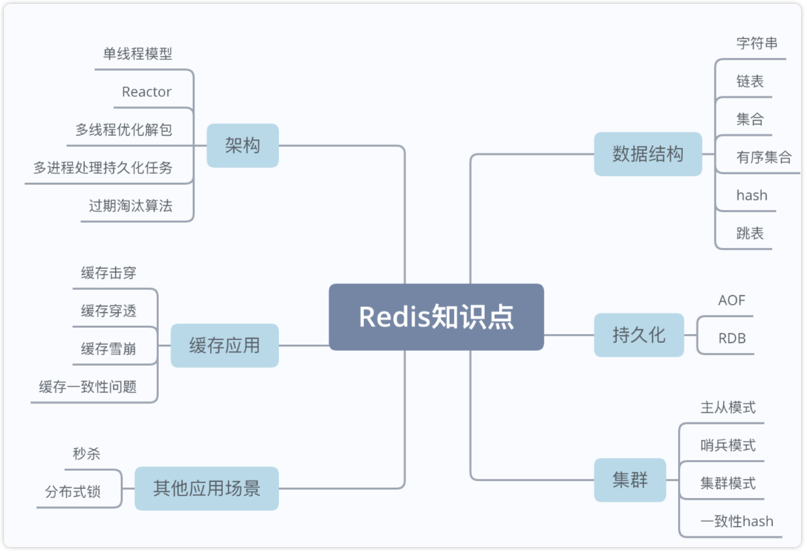
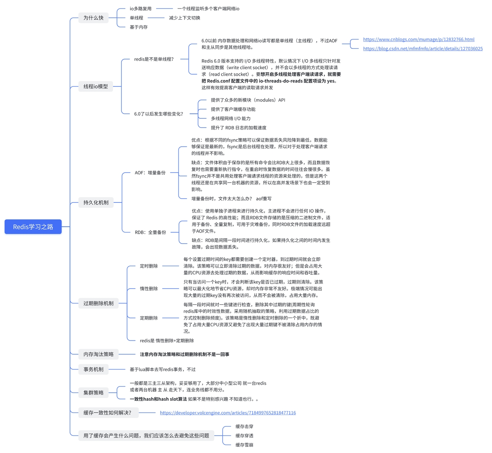

# Redis数据库缓存🥷🏻

## Redis背景✆

MySQL在高并发场景下可能会面临**性能瓶颈、数据库连接压力、锁竞争、缓存不足和扩展性受限等问题**。为了提高系统的性能和可伸缩性，常常需要结合其他技术和工具，比如缓存系统（如Redis）。

Redis（Remote Dictionary Server）是一个开源的内存数据存储系统，它可以用作数据库、缓存和消息中间件。Redis支持多种数据结构，如字符串（String）、哈希（Hash）、列表（List）、集合（Set）、有序集合（Sorted Set）等，并提供了丰富的操作命令来对这些数据结构进行读写操作。

Redis解决了以下几个问题：

1.   高性能缓存：Redis将数据**存储在内存中，因此具有快速的读写速度**。它适用于需要频繁读写的场景，可以**显著提升应用程序的响应速度和吞吐量。**

2.   数据持久化：**Redis支持数据持久化，可以将数据保存到磁盘上，以防止数据丢失**。通过持久化功能，Redis可以在重启后将数据重新加载到内存中，实现数据的持久化存储。

3.   分布式缓存：**Redis可以作为分布式缓存使用**，多个应用程序实例可以共享同一个Redis集群，提高缓存的命中率和整体性能。**它还提供了一些分布式缓存的特性，如数据分片、数据复制和故障转移等。**

4. 发布订阅消息系统：**Redis支持发布订阅模式，可以实现消息的发布和订阅机制**。应用程序可以通过Redis的发布订阅功能进行消息的异步传递和广播，实现解耦和消息通信。

总之，Redis是一个功能强大的内存数据存储系统，它提供了高性能的数据操作和丰富的功能，可以应用于多种场景，如缓存、数据库、消息中间件等，解决了数据存储和处理的效率、可靠性和可扩展性等问题。

如果没有 Redis 环境，这里是下载安装教学：https://www.runoob.com/redis/redis-install.html

这里是对Redis整体思路上的一个把握

*   **对于初学者而言，了解最基本Redis的缓存数据结构和持久化机制即可🧐**
*   **老鸟的话，为什么不全都看完呢～😋**

所以，总而言之，Redis缓存是我们作为一个后台研发工程师的基础，当我们把Redis这个常用的组件研究到一定的程度，相信我们一定会对后端开发的整体视野上会产生一个新的认知

所以冲鸭～～～

**嘟嘟嘟，Redis打怪之路开始发车～～～**

## Redis 基本原理

### 1. 数据结构

～未完待续
